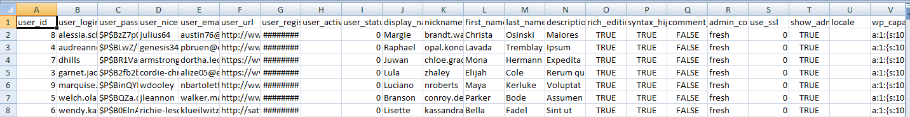
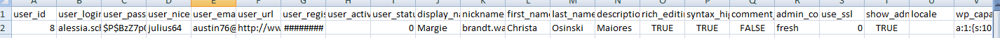

Simple Export and Import of WordPress Users
==========

If you're going to use it. Please use it on your staging or development area first.

Usage
==========

<h4>Download Method</h4>

Using the GET method we use the variable `print` and assign the `role` you want to 
download into a **csv** format.

Sample:

```http://localhost/playground/?print=subscriber```

This will download **subscriber** role.


The CSV file will contain this.




<h4>Upload Method</h4>

We utilize Shortcode API for the upload method.

``[wpie_import_user]``

The output would be:


Now we're going to upload a deleted user using our csv back up.





Success message:

